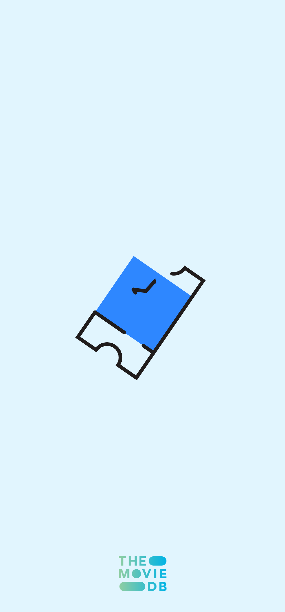

# MovieKu
## Download Now

 

#### Features
* Discover Top Rated and Popular Movies & TV Show on TMDb.
* Search for movies and tv show
* View movie details like release date, rating, overview, **movie trailer** and cast right inside the app.
* Favorite Movie & TV Show
* Watchlist Movie & TV Show
* Notification new Movie & TV Show release
* Sort Favorite Movie & TV Show, Watchlist Movie & TV Show and Favorite People by title/name, popular & vote
* Search Favorite Movie, TV Show and People, Watchlist Movie & TV Show
* Change Language English, Bahasa Indonesia
* Support Dark Mode

#### Architecture and Tech-stack

* Built on MVVM architecture pattern
* Uses [Android Architecture Components](https://developer.android.com/topic/libraries/architecture/), specifically ViewModel, LiveData and Room.
* Heavily uses the [Epoxy Library](https://github.com/airbnb/epoxy/) from Airbnb
* Has a clean, gorgeous user interface with pretty animations, built using Android Transitions framework, and [Material Components for Android](https://github.com/material-components/material-components-android)
* Completely offline ready. MovieDB uses [Room](https://developer.android.com/topic/libraries/architecture/room) for managing a local SQLite database, which means that if you have seen some content already while you were online, you won't need an internet connection to see it again. Everything except movie trailers are cached.
* Uses [Retrofit](https://square.github.io/retrofit/) for making API calls.
* Uses [Glide](https://github.com/bumptech/glide) for image loading.
* Uses [Lottie](https://lottiefiles.com/blog/working-with-lottie/getting-started-with-lottie-animations-in-android-app/) for Animation Image.
* Uses [Firebase ML Kit](https://firebase.google.com/docs/ml-kit/android/translate-text?hl=id) for Translate English to Bahasa Indonesia.

#### Screenshoot

 
<table style="width:100%">
   <tr>
    <td align="center"></td>
    <td align="center"></td>
       <td align="center"></td>
       <td align="center"></td>
  </tr>
    </table>
    <table style="width:100%">
  <tr>
    <th>Dark Mode</th>
    <th>Light Mode</th>
  </tr>
  <tr>
    <td align="center"></td>
    <td align="center"></td>
  </tr>
        <tr>
    <td align="center"></td>
    <td align="center"></td>
  </tr>
         <tr>
    <td align="center"></td>
    <td align="center"></td>
  </tr>
        <tr>
    <td align="center"></td>
    <td align="center"></td>
  </tr>
        <tr>
    <td align="center"></td>
    <td align="center"></td>
  </tr>
        <tr>
    <td align="center"></td>
    <td align="center"></td>
  </tr>
        <tr>
    <td align="center"></td>
    <td align="center"></td>
  </tr>
</table>

